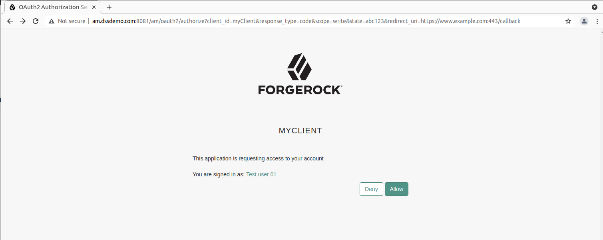
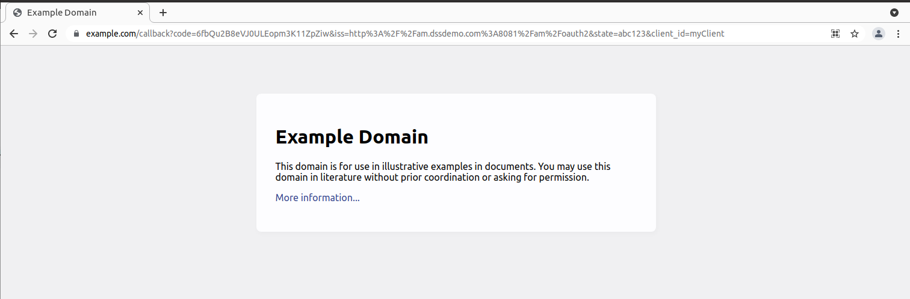

# DSS-Challenge
Mini POC of ForgeRock Platform

## High-level Architecture

```
     ┌───────────────────┐
     │   Config Store    │           ┌──────────────────────────┐
     └──────────┬────────┘           │  web application, APIs,  │
                │                    │      microservices       │
                │                    └─────────────┬────────────┘
                │                                  │
                │                                  │
      ┌─────────┴───────────┐             ┌────────┴───────────┐
      │  Access Management  ├─────────────┤  Identity Gateway  │
      └─────────┬─────────┬─┘             └────────────────────┘
                │         |                           
┌───────────────┴───────┐ |                    ┌─────────────────┐
│  Identities Store     | └────────────────────┤ Platform UIs    │
└────────────────────┬──┘                      └────────┬────────┘
                     │                                  │
                  ┌──┴───────────────────────┐          │
                  │  Identities Management   ├──────────┘
                  └──────────────────────────┘
```

## Environment
### Servers
The servers that are set up and configured for their specific function. All VMs are allocated 1 GB of RAM except for Identity Management Server which is allocated 3 GB RAM.   
The servers are configured with static IPs with the appropriate DNS records.

|Function   |Server name|IPv4|
|---|---|---|
| Config Store | config.dssdemo.com | 100.113.141.8/27 |
| Identities Store | identities.dssdemo.com | 100.113.141.9/27 |
| Access Management | am.dssdemo.com   | 100.113.141.10/27 |
| Identity Management | openidm.dssdemo.com | 100.113.141.11/27 |
| Identity Gateway | ig.dssdemo.com | 100.113.141.12/27 |
| Platform UIs | platform-uis.dssdemo.com | 100.113.141.13/27 |
| Desktop | desktop.dssdemo.com | DHCP |

### OS
All server VMs are installed with the `Ubuntu 21.04 LTS Server` Operating System.
The Desktop server is installed with `Ubuntu 21.04 LTS Desktop` Operating System.
### JAVA
All servers are installed with the latest release of AdoptOpenJDK's `OpenJDK 11 (LTS)` with the `Hotptot JVM`.
```bash
$ java -version
openjdk version "11.0.11" 2021-04-20
OpenJDK Runtime Environment AdoptOpenJDK-11.0.11+9 (build 11.0.11+9)
OpenJDK 64-Bit Server VM AdoptOpenJDK-11.0.11+9 (build 11.0.11+9, mixed mode)
```
- Assign JAVA_HOME variable
```bash
export JAVA_HOME=/usr/lib/jvm/adoptopenjdk-11-hotspot-amd64
```
## Config Store
The Directory Services 7.1 is installed and configured as the __configuration store__ for the Access Management. It is setup with the `am-config` and `am-cts` profiles.
- Install and setup DS
    ```bash
    $ opendj/setup \
    --deploymentKeyPassword password \
    --rootUserDN uid=admin \
    --rootUserPassword str0ngAdm1nPa55word \
    --monitorUserPassword str0ngMon1torPa55word \
    --hostname config.dssdemo.com \
    --adminConnectorPort 4444 \
    --ldapPort 1389 \
    --enableStartTls \
    --ldapsPort 1636 \
    --profile am-config \
    --set am-config/amConfigAdminPassword:5up35tr0ng \
    --profile am-cts \
    --set am-cts/amCtsAdminPassword:5up35tr0ng \
    --set am-cts/tokenExpirationPolicy:am-sessions-only \
    --acceptLicense
    ```
- Assign the Deployment Key
    ```bash
    $ export DEPLOYMENT_KEY=xxxx...xxxxx
    ```
- Export the pubclic cert
    ```bash
    $ opendj/bin/dskeymgr export-ca-cert \
    --deploymentKey $DEPLOYMENT_KEY \
    --deploymentKeyPassword password \
    --outputFile config-ca-cert.pem
    ```
- Transfer the __config store's__ public key to Access Management server
    ```bash
    scp config-ca-cert.pem karim@am.dssdemo.com:.
    ```
- Start the DS server
    ```bash
    $ opendj/bin/start-ds
    ```
## Identities Store
The Directory Services 7.1 is installed and configured as the __identities store__ for the Access and Identity Management.  It is setup with the `am-identity-store` and `idm-repo` profiles.
- Install and setup DS
    ```bash
    $ opendj/setup \
    --deploymentKeyPassword password \
    --rootUserDN uid=admin \
    --rootUserPassword str0ngAdm1nPa55word \
    --monitorUserPassword str0ngMon1torPa55word \
    --hostname identities.dssdemo.com \
    --adminConnectorPort 4444 \
    --ldapPort 1389 \
    --enableStartTls \
    --ldapsPort 1636 \
    --profile am-identity-store \
    --set am-identity-store/amIdentityStoreAdminPassword:5up35tr0ng \
    --profile idm-repo \
    --set idm-repo/domain:forgerock.io \
    --acceptLicense
    ```
- Assign the Deployment Key
    ```bash
    $ export DEPLOYMENT_KEY=xxxx...xxxxx
    ```
- Export the pubclic cert
    ```bash
    $ opendj/bin/dskeymgr export-ca-cert \
    --deploymentKey $DEPLOYMENT_KEY \
    --deploymentKeyPassword password \
    --outputFile identities-ca-cert.pem
    ```
- Transfer the __identities store's__ public key to Access Management and Identity Management server
    ```bash
    scp config-ca-cert.pem karim@am.dssdemo.com:.
    ```
- Start the DS server
    ```bash
    $ opendj/bin/start-ds
    ```
## Access Management
Download and Install and Configure AM 7.1
### Setup the latest Apache Tomcat® application container
```bash
# create tomcat user and group
$ sudo useradd -m -U -d /opt/tomcat -s /bin/false tomcat
# latest Tomcat Version
$ VERSION=9.0.52
# Download Tomcat
$ wget https://www-eu.apache.org/dist/tomcat/tomcat-9/v${VERSION}/bin/apache-tomcat-${VERSION}.tar.gz -P /tmp
# Extract to the appropriate folder
$ sudo tar -xf /tmp/apache-tomcat-${VERSION}.tar.gz -C /opt/tomcat/
# Symbolink link
$ sudo ln -s /opt/tomcat/apache-tomcat-${VERSION} /opt/tomcat/latest
# Assign to tomcat user and group
$ sudo chown -R tomcat: /opt/tomcat
# Correct the execute permissions
$ sudo sh -c 'chmod +x /opt/tomcat/latest/bin/*.sh'
# Setup the service
$ sudo nano /etc/systemd/system/tomcat.service
    [Unit]
    Description=Tomcat 9 servlet container
    After=network.target

    [Service]
    Type=forking

    User=tomcat
    Group=tomcat

    Environment="JAVA_HOME=/usr/lib/jvm/java-11-openjdk-amd64"
    Environment="JAVA_OPTS=-Djava.security.egd=file:///dev/urandom -Djava.awt.headless=true"

    Environment="CATALINA_BASE=/opt/tomcat/latest"
    Environment="CATALINA_HOME=/opt/tomcat/latest"
    Environment="CATALINA_PID=/opt/tomcat/latest/temp/tomcat.pid"
    Environment="CATALINA_OPTS=-Xms512M -Xmx1024M -server -XX:+UseParallelGC"

    ExecStart=/opt/tomcat/latest/bin/startup.sh
    ExecStop=/opt/tomcat/latest/bin/shutdown.sh

    [Install]
    WantedBy=multi-user.target

# Use port 8081
$ sudo nano /opt/tomcat/latest/conf/server.xml
        <Connector port="8081" protocol="HTTP/1.1" connectionTimeout="20000" redirectPort="8443" />
# Load the config and start the service
$ sudo systemctl daemon-reload
$ sudo systemctl enable --now tomcat
$ sudo systemctl status tomcat
```
- Browse to http://am.dssdemo.com:8081/
### Configure Secure connection to Config and Identities Store
```bash
# Create the directory for the keystore
$ sudo mkdir -p /opt/openam-security/
# Import Config Store's key
$ keytool \
-importcert \
-trustcacerts \
-alias config-ca-cert \
-file config-ca-cert.pem \
-keystore /opt/openam-security/truststore \
-storepass St0rP@sswd \
-storetype JKS
# Import Identities Store's key
$ keytool \
-importcert \
-trustcacerts \
-alias identities-ca-cert \
-file identities-ca-cert.pem \
-keystore /opt/openam-security/truststore \
-storepass St0rP@sswd \
-storetype JKS
# Verify key's have been imported
$ keytool \
-list \
-keystore /opt/openam-security/truststore \
-storepass St0rP@sswd
# Update AM webapp with the store's public keys
$ sudo vi /opt/tomcat/latest/bin/setenv.sh
    export CATALINA_OPTS="$CATALINA_OPTS -Djavax.net.ssl.trustStore=/opt/openam-security/truststore \
    -Djavax.net.ssl.trustStorePassword=St0rP@sswd \
    -Djavax.net.ssl.trustStoreType=jks" 
# Verify secure connection to Config Store
$ opendj/bin/ldapsearch \
--hostname config.dssdemo.com \
--port 1636 \
--useSsl \
--useJavaTrustStore /opt/openam-security/truststore \
--trustStorePassword St0rP@sswd \
--bindDn uid=am-config,ou=admins,ou=am-config \
--bindPassword 5up35tr0ng \
--baseDn ou=am-config \
"(&)" \
1.1
# Verify secure connection to Identities Store
$ opendj/bin/ldapsearch \
--hostname identities.dssdemo.com \
--port 1636 \
--useSsl \
--useJavaTrustStore /opt/openam-security/truststore \
--trustStorePassword St0rP@sswd \
--bindDn uid=am-identity-bind-account,ou=admins,ou=identities \
--bindPassword 5up35tr0ng \
--baseDn ou=identities \
"(&)" \
1.1
# Install Access Management web app
cp AM-7.1.0.war /opt/tomcat/latest/am.war
```
### Import Authentication Trees using Amster
```bash
# In Amster
connect --interactive http://am.dssdemo.com:8081/am
import-config --path /home/karim/dss-demo/sample-trees-7.1.0/root
```
### Configure Access Management
After configuring the AM, verify connection through a REST API POST request. The AM server will respond with a valid `tokenID`.
```bash
# REST API request
$ curl \
--request POST \
--header "Content-Type: application/json" \
--header "X-OpenAM-Username: amAdmin" \
--header "X-OpenAM-Password: Passw0rd" \
--header "Accept-API-Version: resource=2.0, protocol=1.0" \
'http://am.dssdemo.com:8081/am/json/realms/root/authenticate'

# Response
{"tokenId":"iu6LNlgvvBgGJGNYt1j_OaZtBM8.*AAJTSQACMDEAAlNLABxzWXRlT1R6Umc4d1A3eGxranZHNkhrcmt2c009AAR0eXBlAANDVFMAAlMxAAA.*","successUrl":"/am/console","realm":"/"}
```
## Identity Gateway

## Identity Management
Download, Install and Configure IDM 7.1 
- Assign JAVA_HOME to /usr
    ```bash
    export JAVA_HOME="/usr"
    ```
- Download the relevant configuration files and customize as per requirement
    ```bash
    cp *.json openidm/conf/
    vi openidm/conf/repo.ds.json
    vi openidm/conf/authentication.json
    vi openidm/conf/servletfilter-cors.json
    ```
- Import Identities Store's public certificate
    ```bash
    $ keytool \
    -importcert \
    -alias identities-ca-cert \
    -file identities-ca-cert.pem \
    -keystore openidm/security/truststore \
    -storepass:file openidm/security/storepass
    ```
- Verify secure connection to Identities Store
    ```bash
    $ opendj/bin/ldapsearch \
    --hostname identities.dssdemo.com \
    --port 1636 \
    --useSsl \
    --useJavaTrustStore openidm/security/truststore \
    --trustStorePassword:file openidm/security/storepass \
    --bindDn uid=am-identity-bind-account,ou=admins,ou=identities \
    --bindPassword 5up35tr0ng \
    --baseDn ou=identities \
    "(&)" \
    1.1
    ```
### Authorization Code Grant Flow
#### Authorization Code Grant Flow using Browser
- In browser URL box
    ```bash
    http://am.dssdemo.com:8081/am/oauth2/realms/root/authorize \
    ?client_id=myClient \
    &response_type=code \
    &scope=write \
    &state=abc123 \
    &redirect_uri=https://www.example.com:443/callback
    ```
- Provide Credentials and Click Allow
    
- Take note URL has the code
    
    ```bash
    https://www.example.com/callback?code=mlmjk9-_pgojRnjo5OrgoeAzMxs&iss=http%3A%2F%2Fam.dssdemo.com%3A8081%2Fam%2Foauth2&state=abc123&client_id=myClient
    ```
- Exchange code for token
    ```bash
    $ curl --request POST \
    --data "grant_type=authorization_code" \
    --data "code=mlmjk9-_pgojRnjo5OrgoeAzMxs" \
    --data "client_id=myClient" \
    --data "client_secret=forgerock" \
    --data "redirect_uri=https://www.example.com:443/callback" \
    "http://am.dssdemo.com:8081/am/oauth2/realms/root/access_token"
    # Response
    {"access_token":"CHrpLws5HA-ItgS026eLfUQnykk","scope":"write","token_type":"Bearer","expires_in":3599}
    ```
#### Authorization Code Grant Flow using credentials
```bash
$ curl --request POST --header "Content-Type: application/json" --header "X-OpenAM-Username: demo" --header "X-OpenAM-Password: Ch4ng31t" --header "Accept-API-Version: resource=2.0, protocol=1.0" 'http://am.dssdemo.com:8081/am/json/realms/root/authenticate'
# response
{"tokenId":"hg4Y7ziIUHul98DyVf9VHsf9cUA.*AAJTSQACMDEAAlNLABxFSWtMcGhZMW1ySzduVlR6cWFJK2JNdEdOYjA9AAR0eXBlAANDVFMAAlMxAAA.*","successUrl":"/am/console","realm":"/"}
```
### Client Credentials Grant Flow
```bash
# Client Credentials Grant Flow using credentials
$ curl --request POST --header "Content-Type: application/json" --header "X-OpenAM-Username: demo" --header "X-OpenAM-Password: Ch4ng31t" --header "Accept-API-Version: resource=2.0, protocol=1.0" 'http://am.dssdemo.com:8081/am/json/realms/root/authenticate'
# Response
{"tokenId":"hg4Y7ziIUHul98DyVf9VHsf9cUA.*AAJTSQACMDEAAlNLABxFSWtMcGhZMW1ySzduVlR6cWFJK2JNdEdOYjA9AAR0eXBlAANDVFMAAlMxAAA.*","successUrl":"/am/console","realm":"/"}
```
## Improvements
- Set up HTTPS connection.
## Resources
